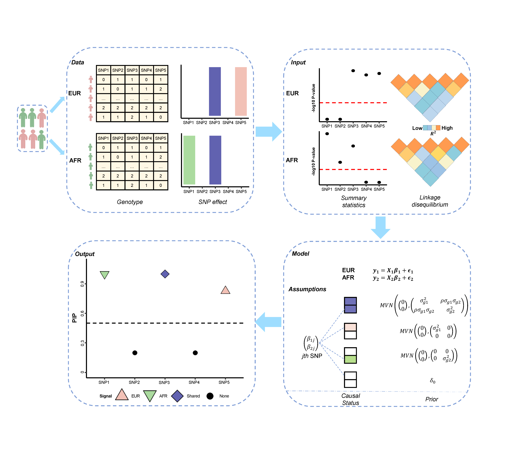

# MESuSiE

## Multiple Ancestry Sum of Single Effect Model (MESuSiE)



MESuSiE relies on GWAS summary statistics from multiple ancestries, properly accounts for the LD structure of the local genomic region in multiple ancestries, and explicitly models both shared and ancestry-specific causal signals to accommodate causal effect size similarity as well as heterogeneity across ancestries. MESuSiE outputs posterior inclusion probability of variant being shared or ancestry-specific causal variants. 
MESuSiE is implemented as an open-source R package, freely available at [Zhou lab](www.xzlab.org/software.html).

## Installation

To install the latest version of the MESuSiE package from GitHub, run
the following code in R:

```R
library(devtools)
install_github("borangao/MESuSiE")
```

This command should automatically install all required packages if
they are not installed already.

## Quick Start

See [Tutorial](https://borangao.github.io/meSuSie_Analysis/) for detailed documentation and examples.

## Reproduce

See [Repository](https://zenodo.org/deposit/8411004#) for reproducing the simulation and real data analysis in the manuscript. 


## Issues
All feedback, bug reports and suggestions are warmly welcomed! Please make sure to raise issues with a detailed and reproducible exmple and also please provide the output of your sessionInfo() in R! 

How to cite `MESuSiE`
-------------------
Boran Gao, Xiang Zhou#. MESuSiE enables scalable and powerful multi-ancestry fine-mapping of causal variants in genome-wide association studies.
